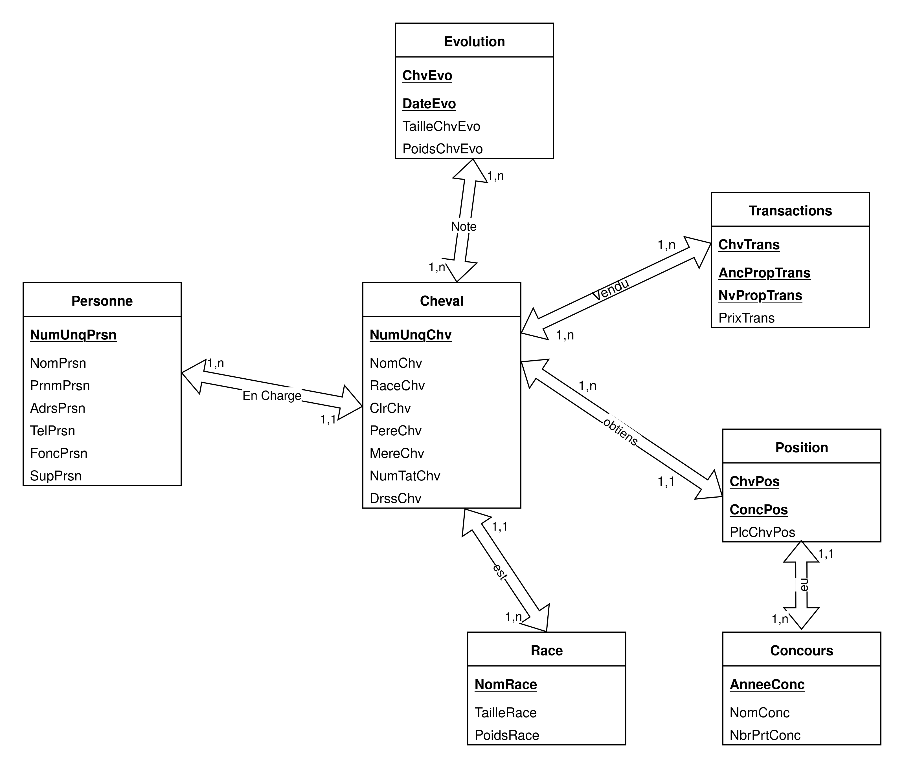

# EX2 (ALI BOUYAKHSASS)

## I

### Question 1

| Concept | Donnnes | Valeur |
| ------- | ------- | ------ |
| Cheval | NomPrsn | directeur |
| Personnes | PrnmPrsn | secretaire |
| Race | AdrsPrsn | eleveur |
| Concours | TelPrsn | comptable |
| Evolution | NumUnqPrsn | proprietaire |
| Transactions | FoncPrsn | entretien |
| Positions | SupPrsn | eleveur-proprietaire |
| | NomChv | |
| | RaceChv | |
| | ClrChv | |
| | NumUnqChv | |
| | DateEvo | |
| | PoidsChvEvo | |
| | TailleChvEvo | |
| | NomRace | |
| | PoidsRace | |
| | TailleRace | |
| | PereChv | |
| | MereChv | |
| | NumTatChv | |
| | DrssChv | |
| | NomConc | |
| | AnneeConc | |
| | NbrPrtConc | |
| | PlcChvPos | |
| | ChvPos | |
| | ConcPos | |
| | ChvTans | |
| | AncPropTrans | |
| | NvPropTrans | |
| | PrixTrans | |

### Question 2

| Code Donnee | Designation | Type | Taille | Observation |
|--|--|--|--|--|
| NumUnqPrsn | Numero unique d'une personne | Numerique | 10 | Id. des Personnes |
| NomPrsn | Nom d'une personne | Alphabetique | 30 | |
| PrnmPrsn | Prenom d'une personne | Alphabetique | 30 | |
| TelPrsn | Telephone d'une personne | Numerique | 10 | |
| AdrsPrsn | Adresse d'une personne | Alphanumerique | 64 | |
| FoncPrsn | Fonction d'une personne | Alphabetique | 20 | |
| SupPrsn | Superieur d'une personne | Numerique? | 10 | Peut etre nulle (FoncPrsn=directeur ou FoncPrsn n'est pas un personnel) |
| NumUnqChv | Numero Unique du cheval | Numerique | 10 | Id. des chevaux |
| NomChv | Nom du cheval | Alphabetique | 25 | |
| RaceChv | Race du cheval | Alphabetique | 20 | |
| ClrChv | Couleur du cheval | Alphabetique | 16 | |
| DateEvo | Date de prise du poid et taille du cheval | Date | | |
| ChvEvo | L'identifiant du cheval | Numerique | 10 | |
| PoidsChvEvo | Evolution du poids du cheval (kg) | Numerique | 6 | |
| TailleChvEvo | Evolution de la taille du cheval | Numerique | 6 | |
| NomRace | Nom de la race | Alphabetique | 20 | Id. de la race |
| PoidsChv | Poids du cheval (kg) | Numerique | 6 | |
| TailleChv | Taille du cheval | Numerique | 6 | |
| PoidRace | Poids type de la race | Numerique | 6 | Unique, peut etre nulle (cheval < 2 mois) |
| TailleRace | Taille type de la race | numerique | 6 | |
| PereChv | Id. du pere du cheval | Numerique | 10 | |
| MereChv | Id. de la mere du cheval | Numerique | 10 | |
| NumTatChv | Numero de tatouage du cheval | Numerique? | 10 | |
| DrssChv | Id. du dresseur du cheval | Numerique | 10 | |
| AnneeConc | Annee du concours | Date | | Id. des concours |
| NomConc | Nom du concours | Alphanimerique | 30 | |
| NbrPrtConc | Nombre de participants dans le concours | Numerique | 10 | |
| PlcChvPos | Place du cheval dans une competition | Numerique | 4 | |
| ChvPos | Id. du cheval dans la competition | Numerique | 10 | |
| ConcPos | Id. du concours | Date | | |
| ChvTrans | Id. du cheval dans la transaction | Numerique | 10 | |
| AncPropTrans | Id. de l'ancien proprietaire du cheval | Numerique | 10 | |
| NvPropTrans | Id. du nouveau proprietaire du cheval | Numerique | 10 | |
| PrixTrans | Prix de transaction du cheval | Numerique | 12 | |

### Question 3

```txt
LOIS:
cardinalite (attr --> concept)
condition
periodique
```

- chaque personnel a un superieur sauf le directeur
- chaque entite Personne a une attribut "FoncPrsn"
- Chaque element de l'entite Personne a une attribut "SupPrsn" qui est elle meme une entite "Personne"
- Chaque element d'entite cheval appartient a une seule race
- On note mensuelment la taille et le poids de chaque entite "Cheval" dans une nouvelle entite "Suivi"
- Chaque entite "Cheval" possede des attributs "Pere" et "Mere" qui sont eux meme des entites "Cheval"
- Apres 2 mois on attribut un numero de tatouage a une entite "Cheval"
- En un instant donne une entite "Cheval" possede un proprietaire qui est un element "Personne"
- Plusieur elements d'entite cheval participent a plusieurs entites concours
### Question 4

- NumUnqChv --> NomChv, RaceChv, ClrChv, PereChv, MereChv, NumTatChv, DrssChv
- NumUnqPrsn --> NomPrsn, PrnmPrsn, AdrsPrsn, TelPrsn, FoncPrsn, SupPrsn
- NomRace --> PoidsRace, TailleRace
- AnneeConc --> NomConc, NbrPrtConc
- DateEvo, ChvEvo --> PoidsChvEvo, TailleChvEvo
- ChvTrans, AncPropTrans --> NvPropTrans, PrixTrans
- ChvTrans, NvPropTrans --> AncPropTrans, PrixTrans
- ChvPos, CompPos --> PlcChvPos

### Question 5

#### Cheval

| Source | Cible |
| -- | -- |
| NumUnqChv | NomChv |
| NumUnqChv | RaceChv |
| NumUnqChv | ClrChv |
| NumUnqChv | PereChv |
| NumUnqChv | MereChv |
| NumUnqChv | NumTatChv |
| NumUnqChv | DrssChv |

#### Personne

| Source | Cible |
| -- | -- |
| NumUnqPrsn | NomPrsn |
| NumUnqPrsn | PrnmPrsn |
| NumUnqPrsn | AdrsPrsn |
| NumUnqPrsn | TelPrsn |
| NumUnqPrsn | FoncPrsn |
| NumUnqPrsn | SupPrsn |

#### Race

| Source | Cible |
| -- | -- |
| NomRace | PoidsRace |
| NomRace | TailleRace |

#### Concours

| Source | Cible |
| -- | -- |
| AnneeConc | NomConc |
| AnneeConc | NbrPrtConc |

#### Evolution

| Source | Cible |
| -- | -- |
| DateEvo, ChvEvo | PoidsChvEvo |
| DateEvo, ChvEvo | TailleChvEvo |

#### Transactions

| Source | Cible |
| -- | -- |
| ChvTrans, AncPropTrans | NvPropTrans |
| ChvTrans, AncPropTrans | PrixTrans |
| ChvTrans, NvPropTrans | NvPropTrans |
| ChvTrans, NvPropTrans | PrixTrans |

#### Positions

| Source | Cible |
| -- | -- |
| ChvPos, CompPos | PlcChvPos |

## II

### Question 1 - II

| Personne |
| -- |
| <u>__NumUnqPrsn__</u> |
| NomPrsn |
| PrnmPrsn |
| AdrsPrsn |
| TelPrsn |
| FoncPrsn |
| SupPrsn |

---

| Cheval |
| -- |
| <u>__NumUnqChv__</u> |
| NomChv |
| RaceChv |
| ClrChv |
| PereChv |
| MereChv |
| NumTatChv |
| DrssChv |

---

| Race |
| -- |
| <u>__NomRace__</u> |
| PoidsRace |
| TailleRace |

---

| Concours |
| -- |
| <u>__AnneeConc__</u> |
| NomConc |
| NbrPrtConc |

---

| PlcChvPos | Place du cheval dans une competition | Numerique | 4 | |
| ChvPos | Id. du cheval dans la competition | Numerique | 10 | |
| ConcPos | Id. du concours | Date | | |

| Positions |
| -- |
| <u>__ChvPos__</u> |
| <u>__ConcPos__</u> |
| PlcChvPos |

---

| Evolution |
| -- |
| <u>__DateEvo__</u> |
| <u>__ChvEvo__</u> |
| TaiileChvEvo |
| PoidsChvEvo |

---

| Transactions |
| -- |
| <u>__ChvTrans__</u> |
| <u>__AncPropTrans__</u> |
| <u>__NvPropTrans__</u> |
| PrixTrans |

### Question 2 - II

- Personne --> Encadree --> Personne
- Personne --> en charge --> Cheval
- Cheval --> appratiens --> Personne
- Cheval --> obtiens --> Position
- Position --> appartiens --> Concours
- Cheval --> vendu --> Transaction
- Personne --> achete --> Transaction
- Cheval --> note --> Evolution

### Question 3 - II

