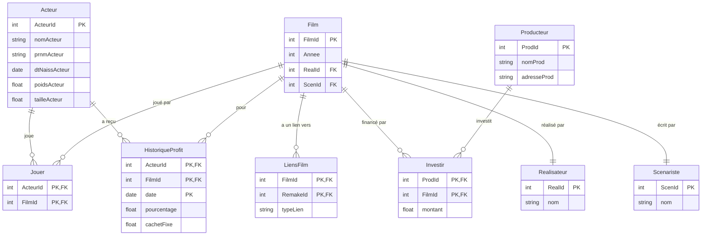

# Exercice 4

## Sturcture

### BDD a partir du CDC (~~pos~~)

Acteur(nomActeur (PK), prnmActeur (PK), dtNaissActeur, poidsActeur, tailleActeur)

Film(Titre (PK), Annee (PK), realisaeur, scenariste)

Producteur(NomProd (PK), adresse)

Investir(NomProd (PK, FK), Titre (PK, FK), Annee (PK, FK) )

### BDD instinctive

Acteur( ActeurId (PK), nomActeur, prnmActeur, dtNaissActeur, poidsActeur, tailleActeur )

Film( FilmId (PK), Annee, RealId (FK), ScenId (FK) )

Realisateur(RealId (PK), nom)

Scenariste( ScenId, (PK), nom)

Jouer( ActeurId (PK, FK), FilmId (PK, FK))

HistoriqueCachet( Acteur (PK, FK), FilmID (PK, FK), date (PK), pourcentage, cachetFixe)

LiensFilm( FilmId (PK, FK), RemakeId (PK, FK), typeLien)

Producteur( ProdId (PK), nomProd, adresseProd )

Investir( ProdId (PK, FK), FilmId (PK, FK), montant)

(Pas de table plusieur a plusieurs pour "Realisateur" et "Scenariste" car le CDC n'a mentione existance d'un seul)

ce design de BDD est 5FN:

- attributs atomiques (1FN)
- pas de dépendances partielles (2FN)
- pas de dépendances transitives (3FN)
- pas de dépendances multivaluées (4FN)
- toutes tes relations N-N sont déjà en tables séparées (5FN)

### Diagrame MLD

