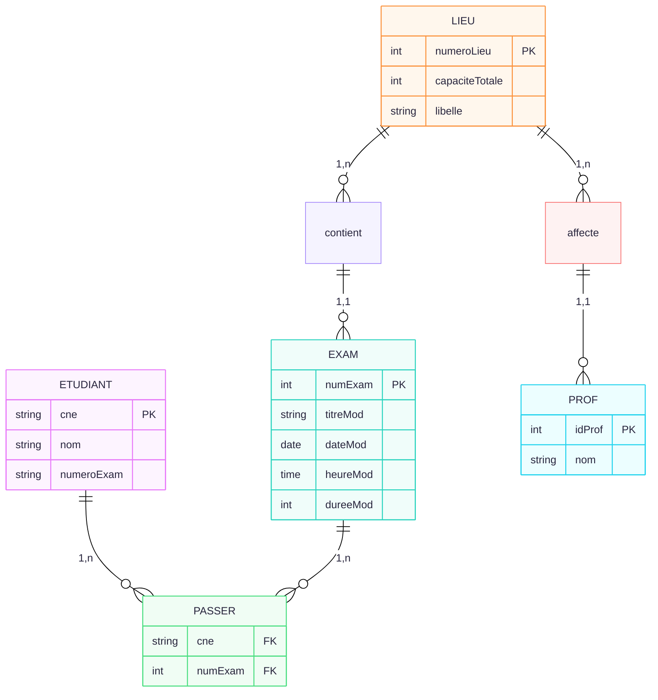
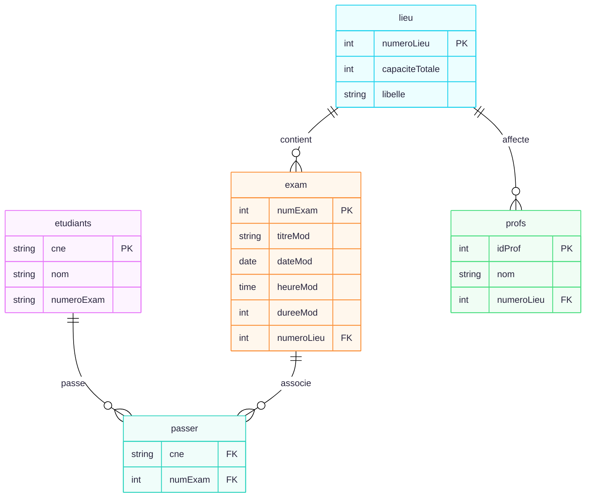
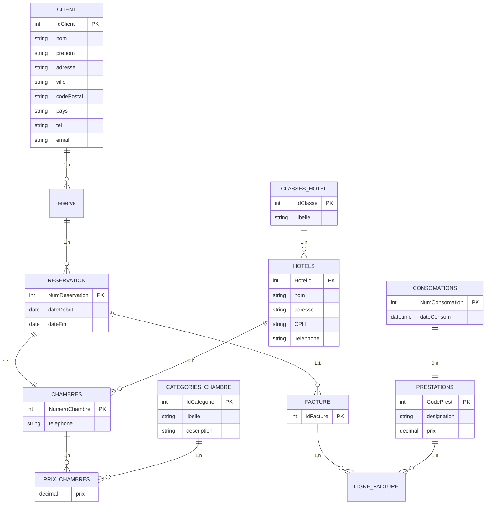
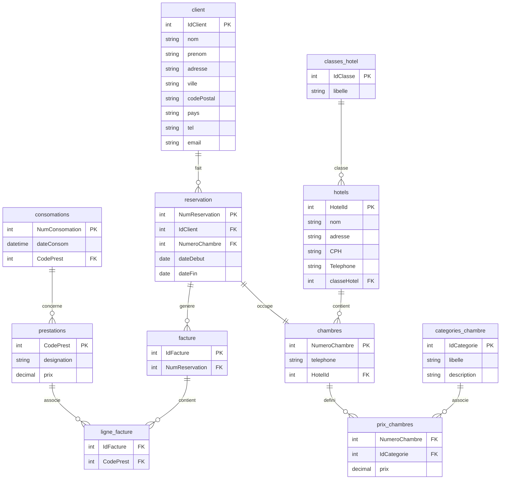
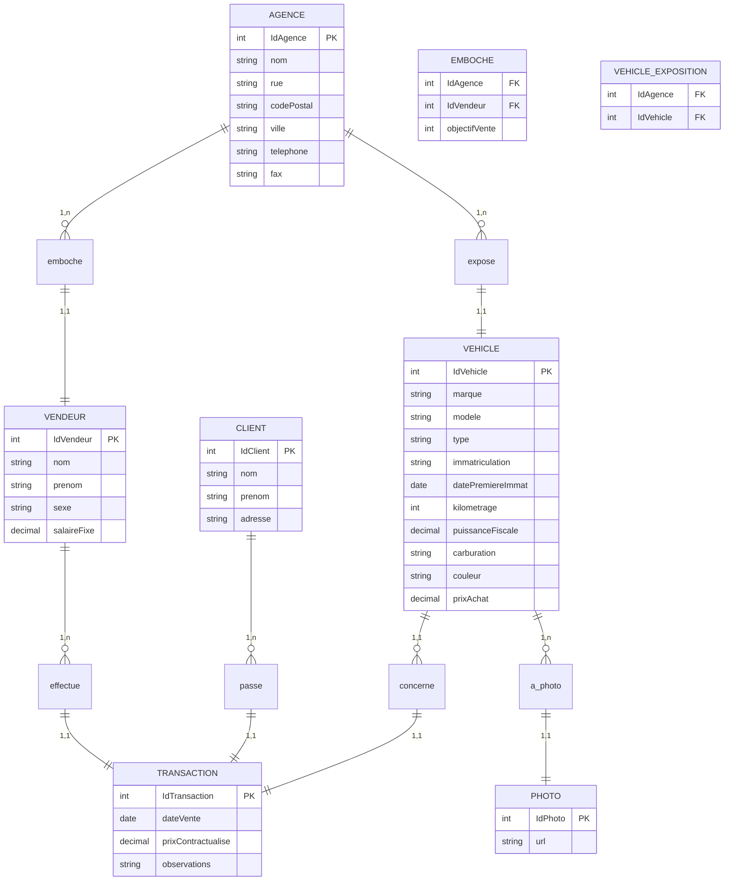
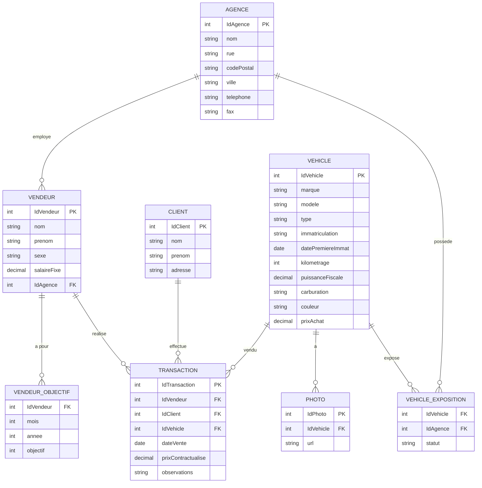

# Devoir 1 (ALI BOUYAKHSASS)

## SUJET 1

Gestion Des Examens

Ce systeme d;information correspond a la gestion des examens d'automne des etudiants S5 de la FSJES.

Un etudiant est inscrit dans un parcours (Gestion ou Eco-Gestion), l'etudiant est connu par son cne, son nom et son numero d'examen. L'etudiant a le droit de passer un examen dans tous les modules auxquels il est inscrit. Le planning des modules comporte le titre du module, la date, l'heure et la duree. Un etudiant passe ses examens dans un meme lieu (salle ou amphi) connu par son numero et sa capacite totale.

La plus part des professeurs assurent la surveillance dans la meme salle ou amphi durant toute la periode des examens On ignore dans cet exercice le group de l'etudiant et les differents sujets par module.

### MCD



### MLD



### Code SQL

etudiants( cne(PK), nom, numeroExam (unique) )
passer ( cne(FK), numExam(FK))
exam ( numExam(PK) , titreMod, dateMod, heureMod, dureeMod, numeroLieu(FK))
lieu ( numeroLieu(PK), capaciteTotale, libelle )
profs ( idProf(PK), nom, numeroLieu (FK) )

```SQL
CREATE TABLE etudiants (
    CNE VARCHAR(10) PRIMARY KEY, 
    nom VARCHAR(50),
    numeroExam VARCHAR(16) UNIQUE
);
CREATE TABLE lieu (
    numeroLieu INT PRIMARY KEY,
    capaciteTotale INT,
    libelle VARCHAR(45)
);
CREATE TABLE exam (
    NumExam INT PRIMARY KEY,
    titreModule VARCHAR(45),
    dateModule DATE,
    heureModule TIME,
    dureeModule INT,
    numeroLieu INT,
    CONSTRAINT FK_EXAM_LIEU FOREIGN KEY (numeroLieu) REFERENCES lieu(numeroLieu)
);
CREATE TABLE passer (
    CNE VARCHAR(10),
    NumExam INT,
    PRIMARY KEY (CNE, NumExam),
    CONSTRAINT FK_PASSER_ETUDIANTS FOREIGN KEY (CNE) REFERENCES etudiants(CNE),
    CONSTRAINT FK_PASSER_EXAM FOREIGN KEY (NumExam) REFERENCES exam(NumExam)
);
CREATE TABLE profs (
    idProf INT PRIMARY KEY,
    nom VARCHAR(50),
    numeroLieu INT,
    CONSTRAINT FK_PROFS_LIEU FOREIGN KEY (numeroLieu) REFERENCES lieu(numeroLieu)
);
```

## Sujet 2

logement(id (PK), quartier(FK), type(FK), surface, loyer, chargesForf)
types( id(PK), libelle)
signataires(id (PK), nom, prenom, dateNaiss, telephone)
occuper(signataire (PK, FK, U), logement (PK, FK) )
quartiers(id (PK), nom, niveau, distance)

## Sujet 3

### MCD



### MLD



## Sujet 4

### MCD



### MLD

