# Devoir 1 (ALI BOUYAKHSASS)

Ce devoir est accessible [en cliquant ici](https://swirx.github.io/IA103/c12/devoirs/1/exports/final_answers.html)

## Sujet 1

Gestion Des Examens

Ce systeme d;information correspond a la gestion des examens d'automne des etudiants S5 de la FSJES.

Un etudiant est inscrit dans un parcours (Gestion ou Eco-Gestion), l'etudiant est connu par son cne, son nom et son numero d'examen. L'etudiant a le droit de passer un examen dans tous les modules auxquels il est inscrit. Le planning des modules comporte le titre du module, la date, l'heure et la duree. Un etudiant passe ses examens dans un meme lieu (salle ou amphi) connu par son numero et sa capacite totale.

La plus part des professeurs assurent la surveillance dans la meme salle ou amphi durant toute la periode des examens On ignore dans cet exercice le group de l'etudiant et les differents sujets par module.

<!-- 
etudiants( cne(PK), nom, numeroExam (unique) )
passer ( cne(FK), numExam(FK))
exam ( numExam(PK) , titreMod, dateMod, heureMod, dureeMod, numeroLieu(FK))
lieu ( numeroLieu(PK), capaciteTotale, libelle )
profs ( idProf(PK), nom, numeroLieu (FK) )
  -->

### MCD


### MLD



### Code SQL

```SQL
CREATE TABLE etudiants (
    CNE VARCHAR(10) PRIMARY KEY, 
    nom VARCHAR(50),
    numeroExam VARCHAR(16) UNIQUE
);
CREATE TABLE lieu (
    numeroLieu INT PRIMARY KEY,
    capaciteTotale INT,
    libelle VARCHAR(45)
);
CREATE TABLE exam (
    NumExam INT PRIMARY KEY,
    titreModule VARCHAR(45),
    dateModule DATE,
    heureModule TIME,
    dureeModule INT,
    numeroLieu INT,
    CONSTRAINT FK_EXAM_LIEU FOREIGN KEY (numeroLieu) REFERENCES lieu(numeroLieu)
);
CREATE TABLE passer (
    CNE VARCHAR(10),
    NumExam INT,
    PRIMARY KEY (CNE, NumExam),
    CONSTRAINT FK_PASSER_ETUDIANTS FOREIGN KEY (CNE) REFERENCES etudiants(CNE),
    CONSTRAINT FK_PASSER_EXAM FOREIGN KEY (NumExam) REFERENCES exam(NumExam)
);
CREATE TABLE profs (
    idProf INT PRIMARY KEY,
    nom VARCHAR(50),
    numeroLieu INT,
    CONSTRAINT FK_PROFS_LIEU FOREIGN KEY (numeroLieu) REFERENCES lieu(numeroLieu)
);
```

## Sujet 2

Gestion d'une agence immobiliere

Une agence de location de maisons a Fes desire gerer sa liste de logements. Elle voudrait en effet connaitre l'implantation de chaque logement (le quartier par exemple: Sidi Brahim, Saada, Bensouda, ...) ainsi que les personnes qui les occupent (les signataires uniquement).

Le loyer depend d'un logement, mais en fonction de son type (maison, studio, T1, T2...) l'agence facturera toujours en plus du loyer la meme somme forfaitaire a ses clients. Par exemple, le prix d'un studio sera toujours egal au prix du loyer + 100dh de charges forfaitaires par mois. Pour chaque logements (les signataires du contrat uniquement), on se contentera de leurs noms, prenoms, date de naissance et numero de telephone. Pour chaque quartier, on desire connaitre le niveau (Haut standing, economique, ...) ainsi que la distance separant le quartier de l'agence.

On ne gerera pas l'historique de l'occupation des logements par les individus.

On considere de plus qu'un individu ne peut etre signataire que d'un seul contrat.

<!-- 
logement(id (PK), quartier(FK), type(FK), surface, loyer, chargesForf)
types( id(PK), libelle)
signataires(id (PK), nom, prenom, dateNaiss, telephone)
occuper(signataire (PK, FK, U), logement (PK, FK) )
quartiers(id (PK), nom, niveau, distance)
-->

### MCD


### MLD


### Code SQL

```sql
-- Quartiers
CREATE TABLE quartiers (
    id INT PRIMARY KEY,
    nom VARCHAR(100),
    niveau INT,
    distance DECIMAL(10,2)
);

-- Types de logement
CREATE TABLE types (
    id INT PRIMARY KEY,
    libelle VARCHAR(50)
);

-- Logements
CREATE TABLE logement (
    id INT PRIMARY KEY,
    quartier INT,
    type INT,
    surface DECIMAL(8,2),
    loyer DECIMAL(10,2),
    chargesForf DECIMAL(10,2),
    CONSTRAINT FK_LOGEMENT_QUARTIER FOREIGN KEY (quartier) REFERENCES quartiers(id),
    CONSTRAINT FK_LOGEMENT_TYPE FOREIGN KEY (type) REFERENCES types(id)
);

-- Signataires
CREATE TABLE signataires (
    id INT PRIMARY KEY,
    nom VARCHAR(50),
    prenom VARCHAR(50),
    dateNaiss DATE,
    telephone VARCHAR(20)
);

-- Occuper (relation signataire ↔ logement)
CREATE TABLE occuper (
    signataire INT,
    logement INT,
    PRIMARY KEY (signataire, logement),
    CONSTRAINT FK_OCCUPER_SIGNATAIRE FOREIGN KEY (signataire) REFERENCES signataires(id),
    CONSTRAINT FK_OCCUPER_LOGEMENT FOREIGN KEY (logement) REFERENCES logement(id),
    CONSTRAINT UQ_OCCUPER_SIGNATAIRE UNIQUE (signataire)
);
```

## Sujet 3

Gestion d'une chaine hoteliere

On souhaite realiser une application web pour la gestion de huit hotels. Chaque hotel est caracterise par son nom son adresse, CPH, Telephone et un code unique. Chaque hotel contient environ 80 chambres, une chambre est caracterisee par son numero et un numero de telephone. On considere que ces hotels sonnt classes en 4 categories ou classes: nombre d'etoiles (de 1 a 5) et les caracteristiques de chaque hotel possede au maximum neuf categories de chambres differentes. Une categorie est connue par son code (Code Categorie) et une descripion.

Cette application consiste a realiser les taches suivantes:
- Consultation de la disponibilite des chambres pour chaque reservation
- L'enregistrement d'une reservation par un client.
- L'enregistrement des diverses consommations (Num. Consommation, Date consommation Heure Consommation) durant le sejour d'un client.
- L'etablissement et l'enregistrement de la facture au depart du client; Cette facture regroupe le prix de la chambre et la quantite des prestation consommees pendant le sejour.
- Pour effectuer une reservation, le client indique son nom, son prenom, son adresse, sa ville, le code postal, son pays, tel et son email. Le client exprime ensuite son besoin: categorie de chambre, periode de sejour (date debut et de fin) et de classe d'hotel. Si la demande est soluble une reservation etablie (Num Reservation, DateDebut, DateFin, DatePayeArrhes, Montant Arrhes).
- Le prix de la categorie d'une chambre depend de la classe d'hotel.
- Les prix des prestations (CodePrest, DesignationPrest) (exemple de prestation: petit dejeuner, dejeuner,...) son propres a chaque hotel.
- Le prix d'une chambre, depends de la categorie et de la classe de l'hotel.
- Une reservation ne concerne qu'une seule chambre.

<!-- 
hotels(HotelId(PK), nom, adresse, CPH, Telephone, classeHotel(FK))
chambres(NumeroChambre(PK), telephone, HotelId(PK,FK))
prix_chambres(NumeroChambre(FK), IdCategorie(FK), prix)
classes_hotel(IdClasse(PK), libelle)
categories_chambre(IdCategorie(PK), libelle, description)
facture(IdFacture(PK), NumReservation(FK))
ligne_facture(Idfacture(FK), CodePrest(FK))
client(IdClient(PK), nom, prenom, adresse, ville, codePostal, pays, tel, email)
reservation(NumReservation(PK), IdClient(FK), NumeroChambre(FK, U), dateDebut(U), dateFin(U))
prestations(CodePrest(PK), designation, prix)
consomations(NumConsomation(PK), dateConsom, CodePrest(FK))
 -->

### MCD



### MLD


### Code SQL

```sql
CREATE TABLE classes_hotel (
    IdClasse INT PRIMARY KEY,
    libelle VARCHAR(50)
);

CREATE TABLE hotels (
    HotelId INT PRIMARY KEY,
    nom VARCHAR(100),
    adresse VARCHAR(150),
    CPH VARCHAR(10),
    Telephone VARCHAR(20),
    classeHotel INT,
    CONSTRAINT FK_HOTELS_CLASSES FOREIGN KEY (classeHotel) REFERENCES classes_hotel(IdClasse)
);

CREATE TABLE categories_chambre (
    IdCategorie INT PRIMARY KEY,
    libelle VARCHAR(50),
    description VARCHAR(200)
);

CREATE TABLE chambres (
    NumeroChambre INT,
    HotelId INT,
    telephone VARCHAR(20),
    PRIMARY KEY (NumeroChambre, HotelId),
    CONSTRAINT FK_CHAMBRES_HOTELS FOREIGN KEY (HotelId) REFERENCES hotels(HotelId)
);

CREATE TABLE prix_chambres (
    NumeroChambre INT,
    IdCategorie INT,
    prix DECIMAL(10,2),
    PRIMARY KEY (NumeroChambre, IdCategorie),
    CONSTRAINT FK_PRIX_CHAMBRES_CHAMBRES FOREIGN KEY (NumeroChambre) REFERENCES chambres(NumeroChambre),
    CONSTRAINT FK_PRIX_CHAMBRES_CATEGORIES FOREIGN KEY (IdCategorie) REFERENCES categories_chambre(IdCategorie)
);

CREATE TABLE client (
    IdClient INT PRIMARY KEY,
    nom VARCHAR(50),
    prenom VARCHAR(50),
    adresse VARCHAR(150),
    ville VARCHAR(50),
    codePostal VARCHAR(10),
    pays VARCHAR(50),
    tel VARCHAR(20),
    email VARCHAR(100)
);

CREATE TABLE reservation (
    NumReservation INT PRIMARY KEY,
    IdClient INT,
    NumeroChambre INT,
    dateDebut DATE,
    dateFin DATE,
    UNIQUE (NumeroChambre, dateDebut, dateFin),
    CONSTRAINT FK_RESERVATION_CLIENT FOREIGN KEY (IdClient) REFERENCES client(IdClient),
    CONSTRAINT FK_RESERVATION_CHAMBRES FOREIGN KEY (NumeroChambre) REFERENCES chambres(NumeroChambre)
);

CREATE TABLE facture (
    IdFacture INT PRIMARY KEY,
    NumReservation INT,
    CONSTRAINT FK_FACTURE_RESERVATION FOREIGN KEY (NumReservation) REFERENCES reservation(NumReservation)
);

CREATE TABLE prestations (
    CodePrest INT PRIMARY KEY,
    designation VARCHAR(100),
    prix DECIMAL(10,2)
);

CREATE TABLE ligne_facture (
    IdFacture INT,
    CodePrest INT,
    PRIMARY KEY (IdFacture, CodePrest),
    CONSTRAINT FK_LIGNE_FACTURE_FACTURE FOREIGN KEY (IdFacture) REFERENCES facture(IdFacture),
    CONSTRAINT FK_LIGNE_FACTURE_PRESTATIONS FOREIGN KEY (CodePrest) REFERENCES prestations(CodePrest)
);

CREATE TABLE consomations (
    NumConsomation INT PRIMARY KEY,
    dateConsom DATETIME,
    CodePrest INT,
    CONSTRAINT FK_CONSOMATIONS_PRESTATIONS FOREIGN KEY (CodePrest) REFERENCES prestations(CodePrest)
);
```

## Sujet 4

### MCD


### MLD


### Code SQL

```sql
-- Agencies
CREATE TABLE agence (
    IdAgence INT PRIMARY KEY,
    nom VARCHAR(100),
    rue VARCHAR(100),
    codePostal VARCHAR(10),
    ville VARCHAR(50),
    telephone VARCHAR(20),
    fax VARCHAR(20)
);

-- Sellers
CREATE TABLE vendeur (
    IdVendeur INT PRIMARY KEY,
    nom VARCHAR(50),
    prenom VARCHAR(50),
    sexe CHAR(1),
    salaireFixe DECIMAL(10,2),
    IdAgence INT,
    CONSTRAINT FK_VENDEUR_AGENCE FOREIGN KEY (IdAgence) REFERENCES agence(IdAgence)
);

-- Seller monthly objectives
CREATE TABLE vendeur_objectif (
    IdVendeur INT,
    mois INT,
    annee INT,
    objectif INT,
    PRIMARY KEY (IdVendeur, mois, annee),
    CONSTRAINT FK_OBJECTIF_VENDEUR FOREIGN KEY (IdVendeur) REFERENCES vendeur(IdVendeur)
);

-- Clients
CREATE TABLE client (
    IdClient INT PRIMARY KEY,
    nom VARCHAR(50),
    prenom VARCHAR(50),
    adresse VARCHAR(200)
);

-- Vehicles
CREATE TABLE vehicle (
    IdVehicle INT PRIMARY KEY,
    marque VARCHAR(50),
    modele VARCHAR(50),
    type VARCHAR(20),
    immatriculation VARCHAR(20),
    datePremiereImmat DATE,
    kilometrage INT,
    puissanceFiscale DECIMAL(5,2),
    carburation VARCHAR(20),
    couleur VARCHAR(20),
    prixAchat DECIMAL(12,2)
);

-- Vehicle exposition in agencies
CREATE TABLE vehicle_exposition (
    IdVehicle INT,
    IdAgence INT,
    statut VARCHAR(20),
    PRIMARY KEY (IdVehicle, IdAgence),
    CONSTRAINT FK_EXPO_VEHICLE FOREIGN KEY (IdVehicle) REFERENCES vehicle(IdVehicle),
    CONSTRAINT FK_EXPO_AGENCE FOREIGN KEY (IdAgence) REFERENCES agence(IdAgence)
);

-- Transactions
CREATE TABLE transaction (
    IdTransaction INT PRIMARY KEY,
    IdVendeur INT,
    IdClient INT,
    IdVehicle INT,
    dateVente DATE,
    prixContractualise DECIMAL(12,2),
    observations VARCHAR(500),
    CONSTRAINT FK_TRANS_VENDEUR FOREIGN KEY (IdVendeur) REFERENCES vendeur(IdVendeur),
    CONSTRAINT FK_TRANS_CLIENT FOREIGN KEY (IdClient) REFERENCES client(IdClient),
    CONSTRAINT FK_TRANS_VEHICLE FOREIGN KEY (IdVehicle) REFERENCES vehicle(IdVehicle)
);

-- Photos
CREATE TABLE photo (
    IdPhoto INT PRIMARY KEY,
    IdVehicle INT,
    url VARCHAR(200),
    CONSTRAINT FK_PHOTO_VEHICLE FOREIGN KEY (IdVehicle) REFERENCES vehicle(IdVehicle)
);
```
