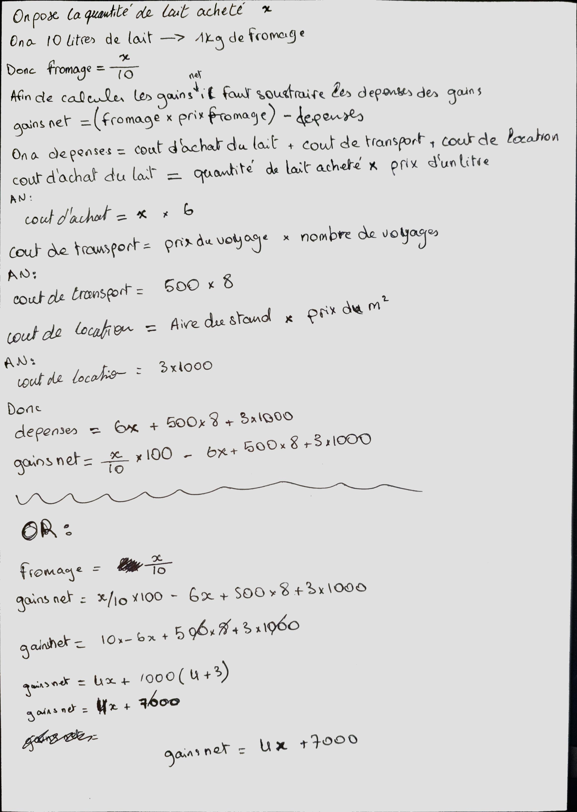

# TD1 (PAR ALI BOUYAKHSASS)

## Exercice 4

### Question 1 (e4)

- Calculer la quantite du fromage fabriquee, et le net a gagner mensuel

#### Raisonment (e4q1)

J'ai formule une reponse breve mais precise

### Question 2 (e4)

- c (Il s'agit d'un probleme de calcul)
- b (Non, le nom est une info redondate)
- a (Oui, quantite de lait requise pour fabriquer 1kg de fromage est essentielle)
- b (Le probleme peut etre decompose en 2 sous-problemes)

#### Raisonement (e4q2)

1. c'est evident
2. Le nom est superflu dans le probleme (pas d'influence sur le raisonement)
3. Elle est indispensable pour resoudre le probleme
4. pt1 (code)

```python
def calculer_rendement(quant_lait) # quant_lait = quantite du lait
    fromage = quant_lait / 10 # la quantite de fromage fabriquee
    net = (fromage * 100) - (quant_lait * 6 + 1000 * 3 + 500 * 8) # fromage*100 = argent recu, quant_lait*6+1000*3+500*8 = depenses
    
    # donc le probleme est divisible en 2 sous-problemes
```

pt2 math:


### Question 3 (e4)

#### Entrees (e4)

- Prix de lait
- Quantite de lait
- Cout fabrication de Fromage en lait
- Prix du fromage
- Prix du m^2
- Aire du Stand
- Cout du transport
- Nombre De Visites au marche

#### Raisonement (e4q3)

- donnes d'enonce (et formateur a dit seul la quantite de n'est pas suffisante)

### Question 4 (e4)

#### Resultats a trouver (e4)

- Quantite du fromage fabriquee
- Net a gagner mensuel

#### Raisonement (e4q4)

- Depuis L'enonce

### Question 5 (e4)

#### Autre Sorties Requises (e4)

- Fromage Fabriquee
- Montant recu
- Cout des depenses (prix de lait, cout de location, cout de transport)

#### Raisonment (e4q5)

on initialise le nom des variables:
on prend la quantite de lait achetee = X
on initialise les constantes:

- Cout de location = Prix du m^2 * Aire du stand
--> rent_cost = 1000 * 3
- Cout de transport = Cout du Transport * Nombre de Visites
--> transportation_cost = 500 * 8
- Prix du lait = Prix d'un litre * Quantite de lait
--> milk_cost = 6 * X
- depenses = Somme des couts
--> expenses = rent_cost + transportation_cost + milk_cost

## Exercice 5

### Question 1 (e5)

- Gestion des ventes d'un magazin

#### Raisonement (e5q1)

J'ai resume le problem de maniere consise et directe

### Question 2 (e5)

#### Entrees (e5)

- prix hors taxe

#### Raisonement (e5q2)

Les seules donnes requises sont la quantite des articles et leur prix hors taxe, et comme on suppose qu'un seul article est achete donc on a besoin de seulement le prix

### Question 3 (e5)

#### Resultats a trouver (e5)

- montant

#### Raisonement (e5q3)

La facture aura le nom et le montant, mais le nom est deja connu selon l'exercise donc il ne fait pas partie des resultat. Et il faut categorizer les client, mais on a pas une facon d'avoir des infos sur la carte de fidelite. Alors le seul resultat est le montant

### Question 4 (e5)

#### Autres Sorties Requises (e5)

- Montant de la remise
- Montant TTC

#### Raisonement (e5q4)

Afin de calculer le montant total il faut calculer la remise sur l'achat et le prix TTC puis soustraire la remise du prix TTC (montant = TTC - remise)

### Question 5 (e5)

#### Types de traitements

- Calcul

#### Raisonement (e5q5)

montant_final = prix_original * 1.15 * .98

### Question 6 (e5)

#### traitement

Si les prix sont hors taxe --> Somme des (prix) de 1 a n produits
Si les prix sont TTC --> Somme des (prix/1.15) de 1 a n produits

#### Raisonement (e5q6)

C'est de la mathematique simple

code:

```python
prices = [] # une liste des prix des n produits
total = sum(p for p in prices) # si les prix sans hors taxe
total = sum(p/1.15 for p in prices) # si les prix sont TTC
```
